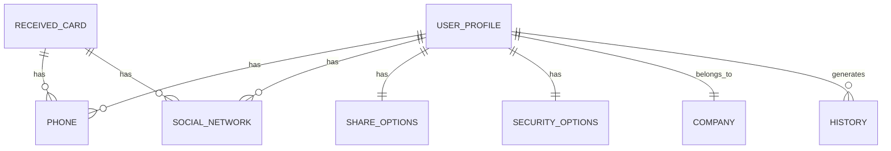

# Relationships

| Campo | Valor |
|-------|-------|
| **Versão** | 1.0 |
| **Projeto** | VCardSmart |
| **Última atualização** | 2026-07-13 |

---

## Diagrama de Relacionamentos



---

## Relacionamentos

### UserProfile → Company
| Tipo | Cardinalidade | Descrição |
|------|---------------|-----------|
| 1:1 | Opcional | Um perfil pertence a uma empresa |

### UserProfile → Phone
| Tipo | Cardinalidade | Descrição |
|------|---------------|-----------|
| 1:N | Opcional | Um perfil pode ter vários telefones |

### UserProfile → SocialNetwork
| Tipo | Cardinalidade | Descrição |
|------|---------------|-----------|
| 1:N | Opcional | Um perfil pode ter várias redes sociais |

### UserProfile → ShareOptions
| Tipo | Cardinalidade | Descrição |
|------|---------------|-----------|
| 1:1 | Obrigatório | Um perfil tem opções de compartilhamento |

### UserProfile → SecurityOptions
| Tipo | Cardinalidade | Descrição |
|------|---------------|-----------|
| 1:1 | Obrigatório | Um perfil tem opções de segurança |

### UserProfile → History
| Tipo | Cardinalidade | Descrição |
|------|---------------|-----------|
| 1:N | Opcional | Um perfil gera histórico de ações |

### ReceivedCard → Phone
| Tipo | Cardinalidade | Descrição |
|------|---------------|-----------|
| 1:N | Opcional | Um cartão recebido pode ter telefones |

### ReceivedCard → SocialNetwork
| Tipo | Cardinalidade | Descrição |
|------|---------------|-----------|
| 1:N | Opcional | Um cartão recebido pode ter redes sociais |

---

## Implementação no Hive

### UserProfile com Phone
```dart
// Hive não suporta relações natas
// Implementação via嵌套 objects

class UserProfileModel {
  final List<PhoneModel> phones;
  final List<SocialNetworkModel> socialNetworks;
}

// Acesso
final profile = box.get('profile');
final phones = profile.phones;
```

---

## Regras

| # | Regra |
|---|-------|
| 1 | Hive não suporta relações SQL-like |
| 2 | Relações são implementadas via嵌套 objects |
| 3 | Listas são armazenadas como arrays |
| 4 | Objetos filhos são serializados junto ao pai |

---

## Documentos Relacionados

- [03_Entities.md](./03_Entities.md)
- [17_ERDiagram.md](./17_ERDiagram.md)
- [18_ClassDiagram.md](./18_ClassDiagram.md)
