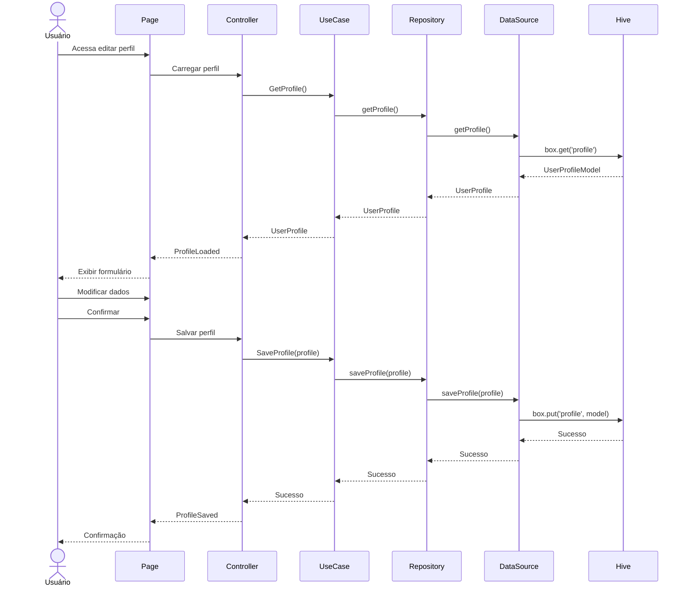
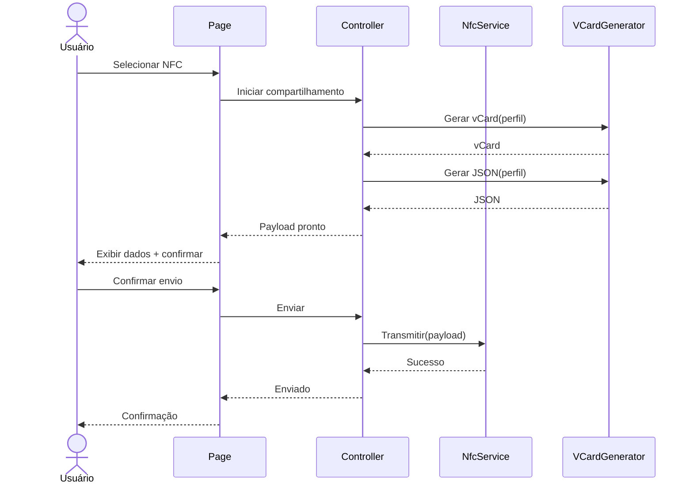
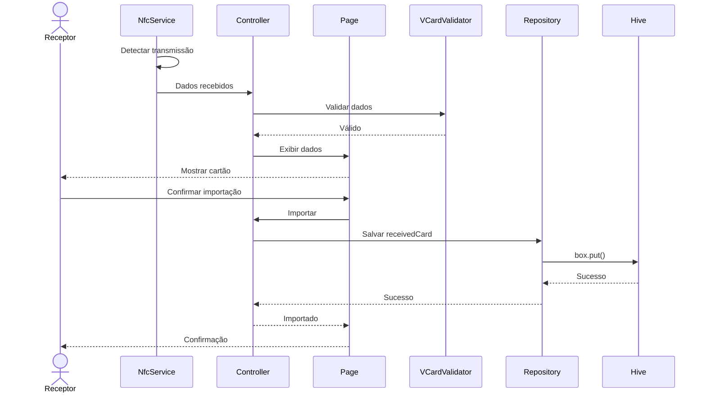
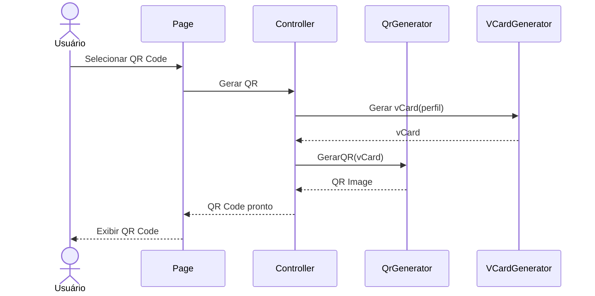
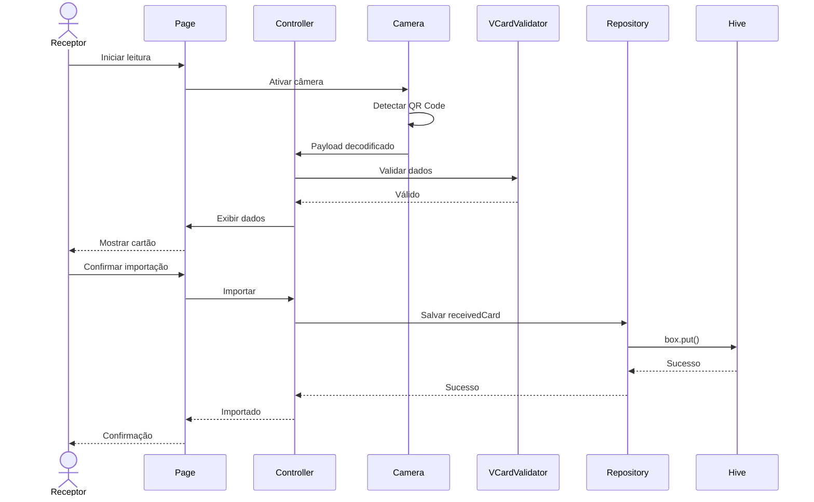

# Sequence Diagrams

| Campo | Valor |
|-------|-------|
| **Versão** | 1.0 |
| **Projeto** | VCardSmart |
| **Última atualização** | 2026-07-13 |

---

## Editar Perfil

---

## Compartilhar NFC

---

## Receber NFC

---

## Gerar QR Code

---

## Ler QR Code

---

## Documentos Relacionados

- [16_SequenceDiagrams.md](./16_SequenceDiagrams.md)
- [17_ERDiagram.md](./17_ERDiagram.md)
- [18_ClassDiagram.md](./18_ClassDiagram.md)
