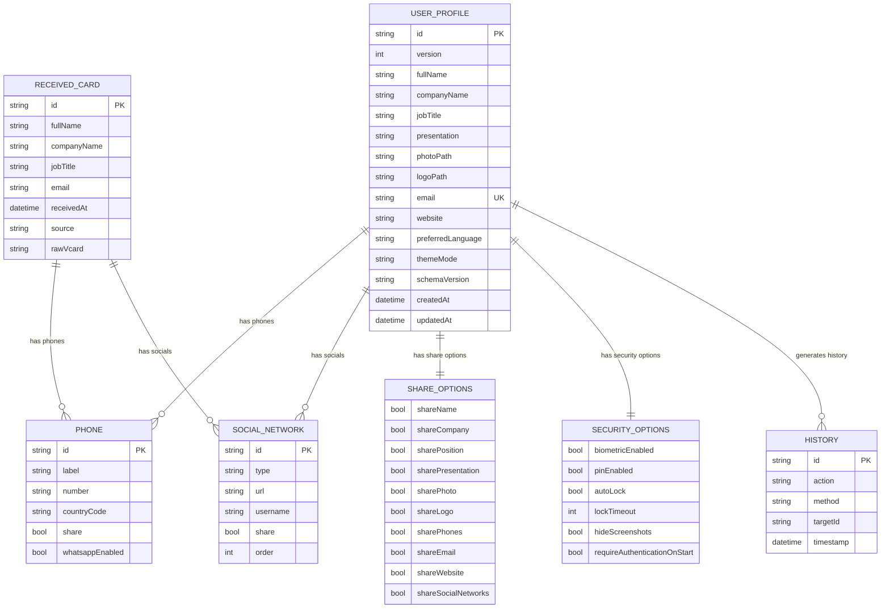

# ER Diagram

| Campo | Valor |
|-------|-------|
| **Versão** | 1.0 |
| **Projeto** | VCardSmart |
| **Última atualização** | 2026-07-13 |

---

## Diagrama ER

---

## Entidades e Relacionamentos

| Entidade | Relacionamento | Entidade | Cardinalidade |
|----------|---------------|----------|---------------|
| USER_PROFILE | has | PHONE | 1:N |
| USER_PROFILE | has | SOCIAL_NETWORK | 1:N |
| USER_PROFILE | has | SHARE_OPTIONS | 1:1 |
| USER_PROFILE | has | SECURITY_OPTIONS | 1:1 |
| USER_PROFILE | generates | HISTORY | 1:N |
| RECEIVED_CARD | has | PHONE | 1:N |
| RECEIVED_CARD | has | SOCIAL_NETWORK | 1:N |

---

## Visualização no VS Code

Os diagramas Mermaid podem ser visualizados no VS Code com a extensão **Mermaid Preview**.

---

## Documentos Relacionados

- [03_Entities.md](./03_Entities.md)
- [09_Relationships.md](./09_Relationships.md)
- [18_ClassDiagram.md](./18_ClassDiagram.md)
