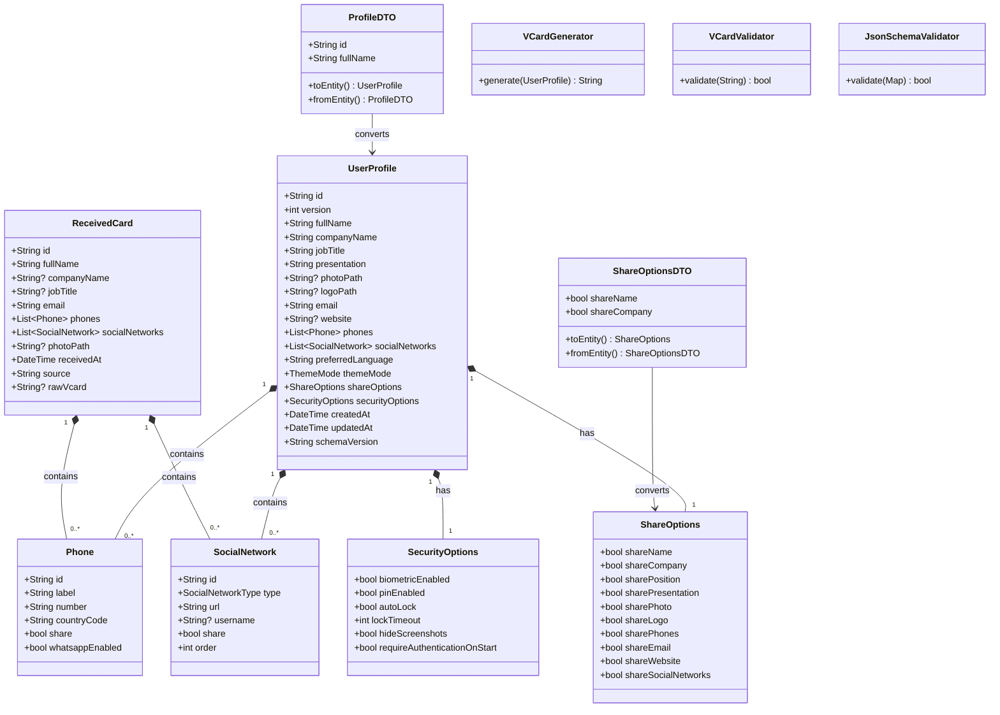

# Class Diagram

| Campo | Valor |
|-------|-------|
| **Versão** | 1.0 |
| **Projeto** | VCardSmart |
| **Última atualização** | 2026-07-13 |

---

## Diagrama de Classes



---

## Hierarquia de Classes

```
Entity
├── UserProfile
├── Phone
├── SocialNetwork
├── ShareOptions
├── SecurityOptions
└── ReceivedCard

DTO
├── ProfileDTO
├── PhoneDTO
├── SocialNetworkDTO
├── ShareOptionsDTO
├── SecurityOptionsDTO
├── VCardDTO
└── ShareDTO

Service
├── VCardGenerator
├── VCardValidator
├── JsonSchemaValidator
└── MigrationService
```

---

## Visualização no VS Code

Os diagramas Mermaid podem ser visualizados no VS Code com a extensão **Mermaid Preview**.

---

## Documentos Relacionados

- [03_Entities.md](./03_Entities.md)
- [05_DTOs.md](./05_DTOs.md)
- [17_ERDiagram.md](./17_ERDiagram.md)
