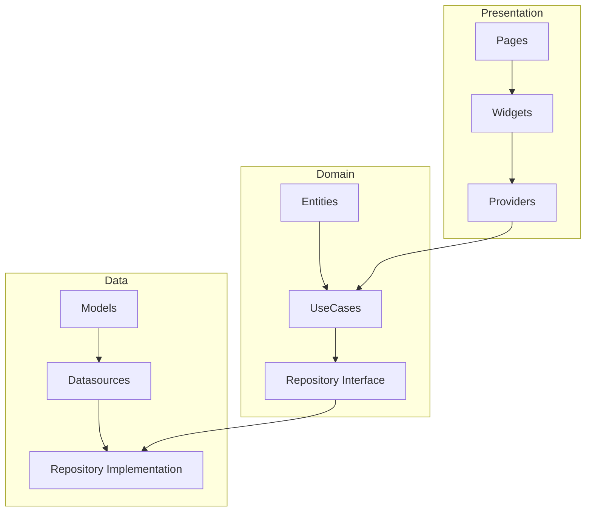
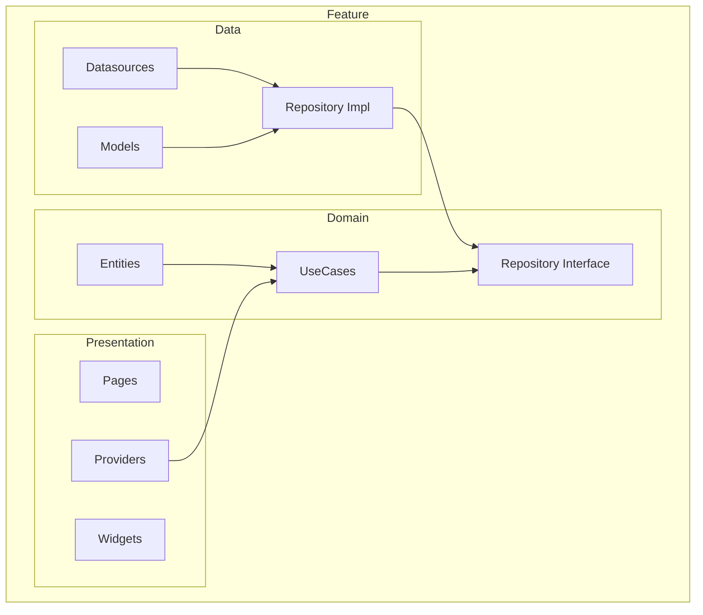
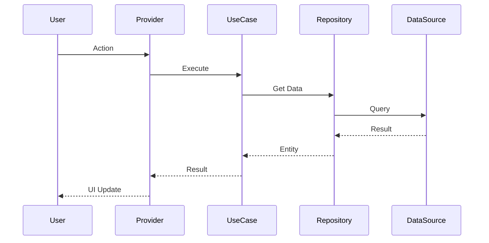
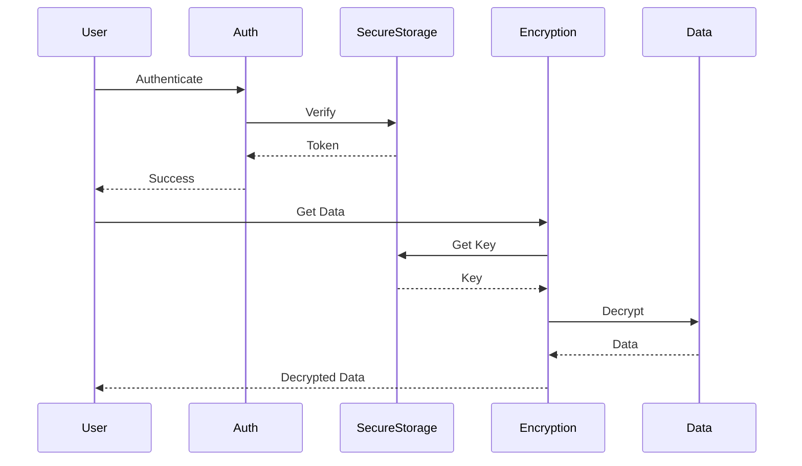
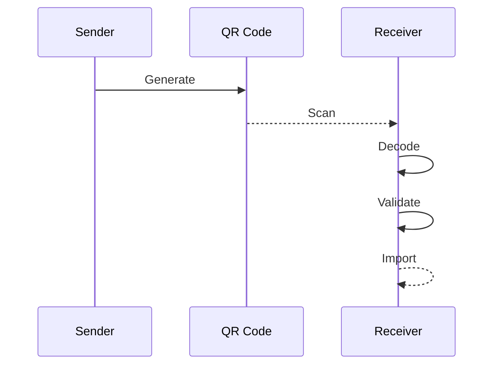
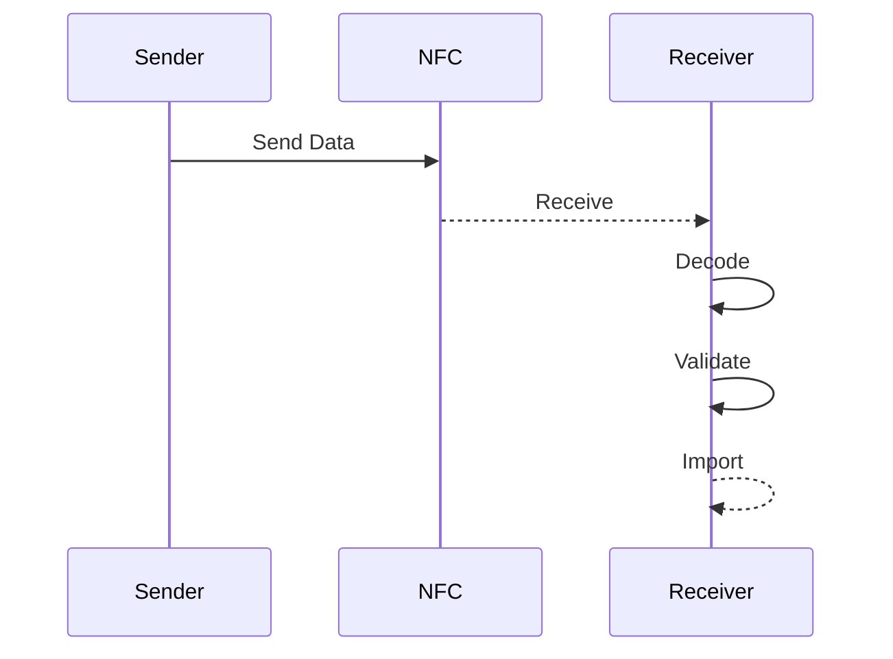
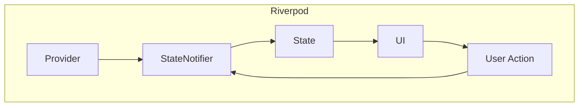
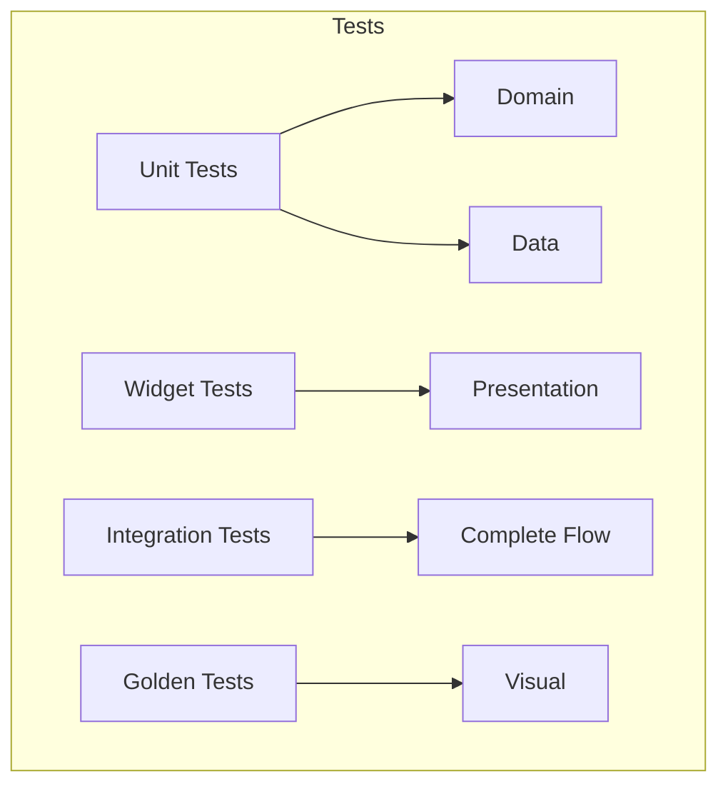
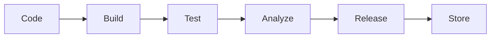
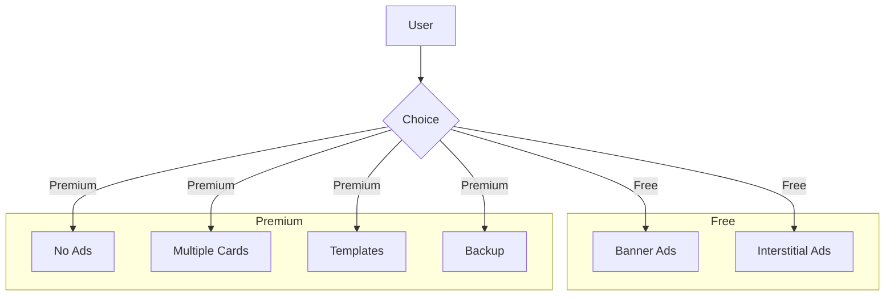

# Diagramas Mermaid — VCardSmart

## Clean Architecture



## Feature Structure



## Data Flow



## Navigation

```mermaid
graph TB
    subgraph GoRouter
        A[/] --> B[/home]
        A --> C[/profile]
        A --> D[/settings]
        A --> E[/history]
        C --> F[/profile/:id]
        C --> G[/profile/create]
        C --> H[/profile/edit/:id]
        A --> I[/import]
        A --> J[/share]
    end
```

## Security Flow



## QR Code Flow



## NFC Flow



## State Management



## Testing Strategy



## Deployment Pipeline



## Monetization Flow


