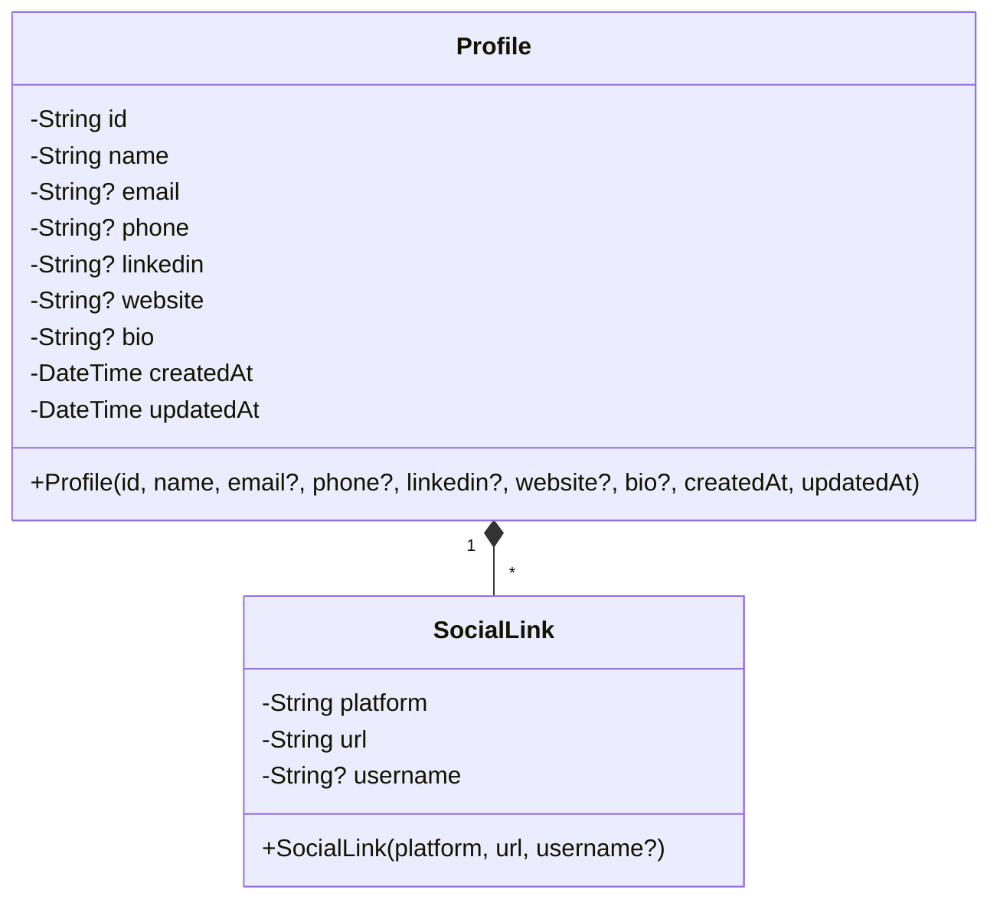
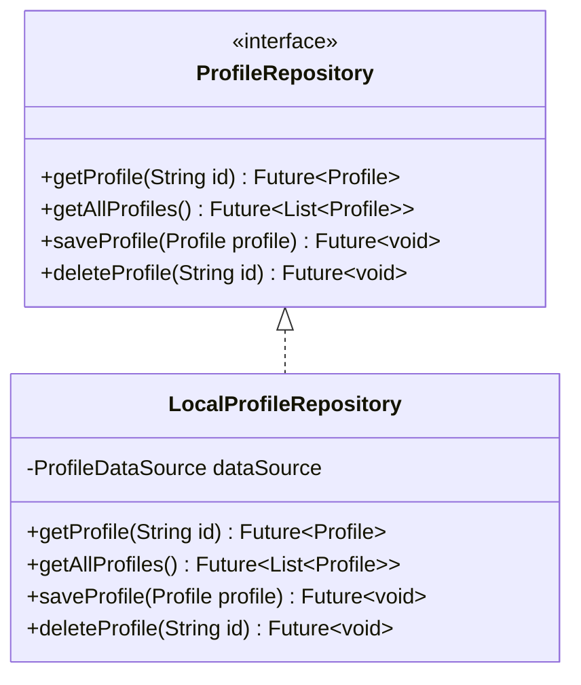
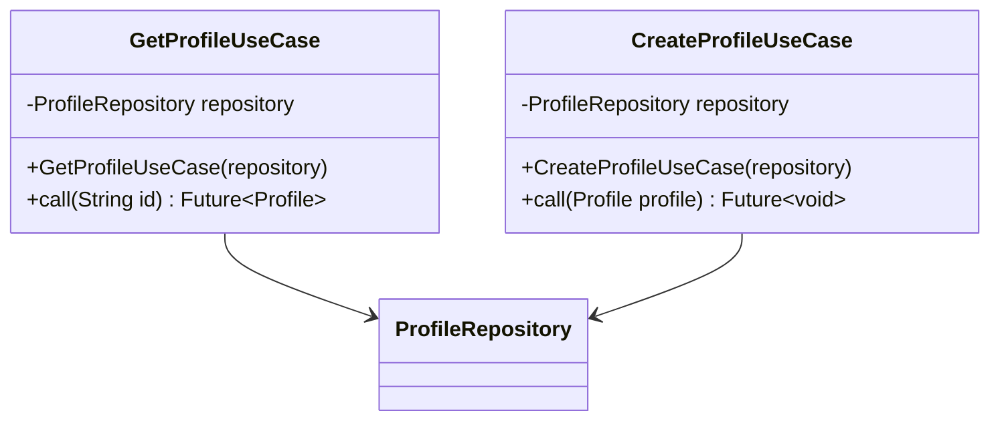
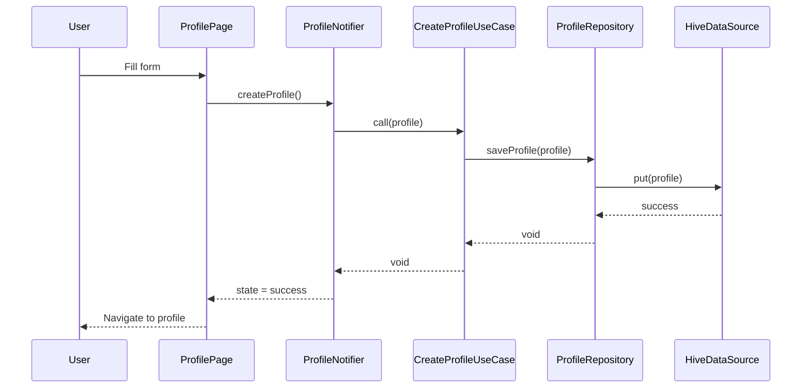
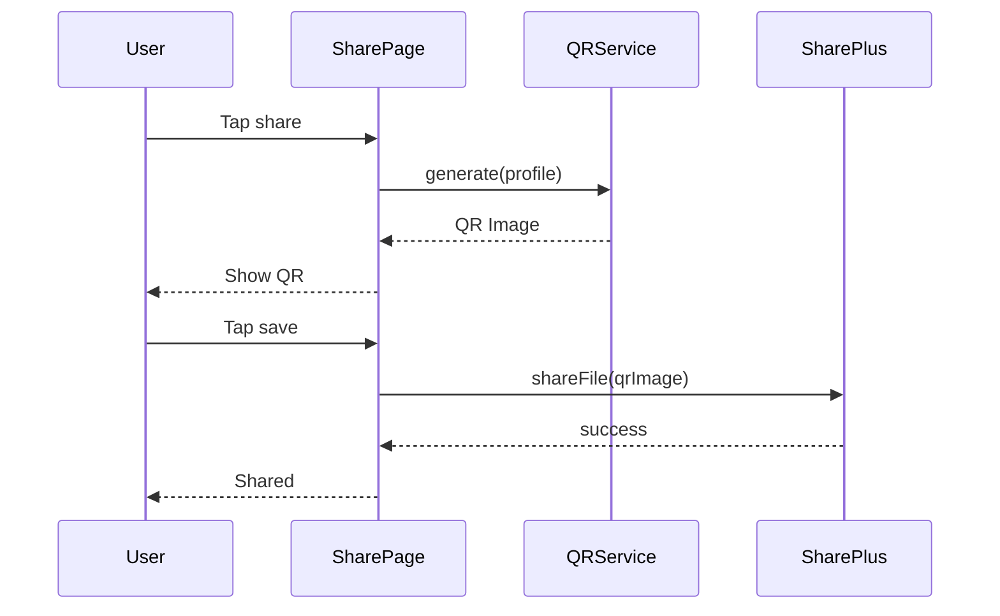
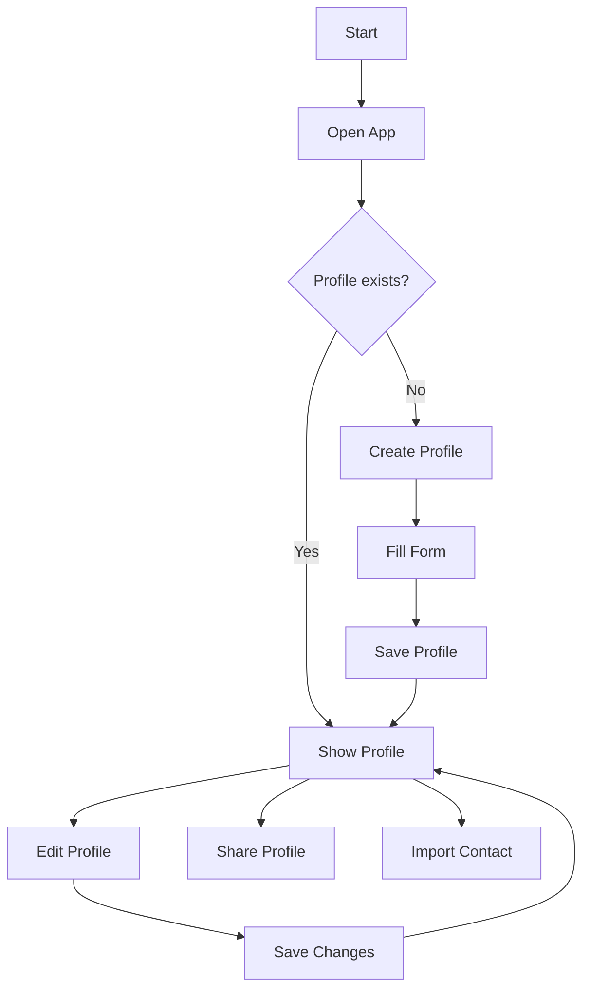
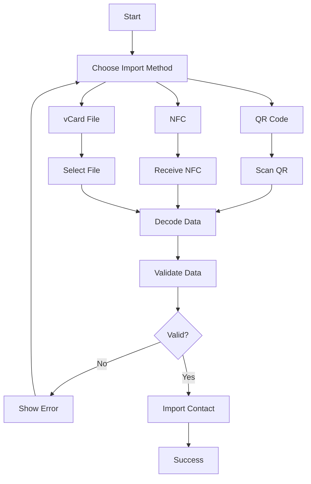
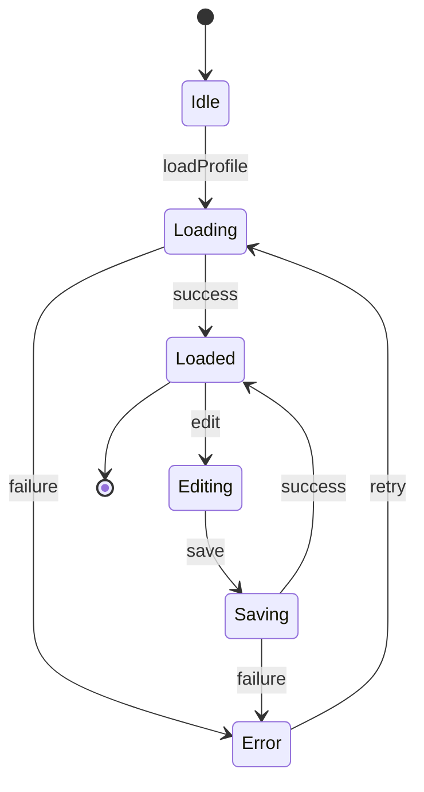
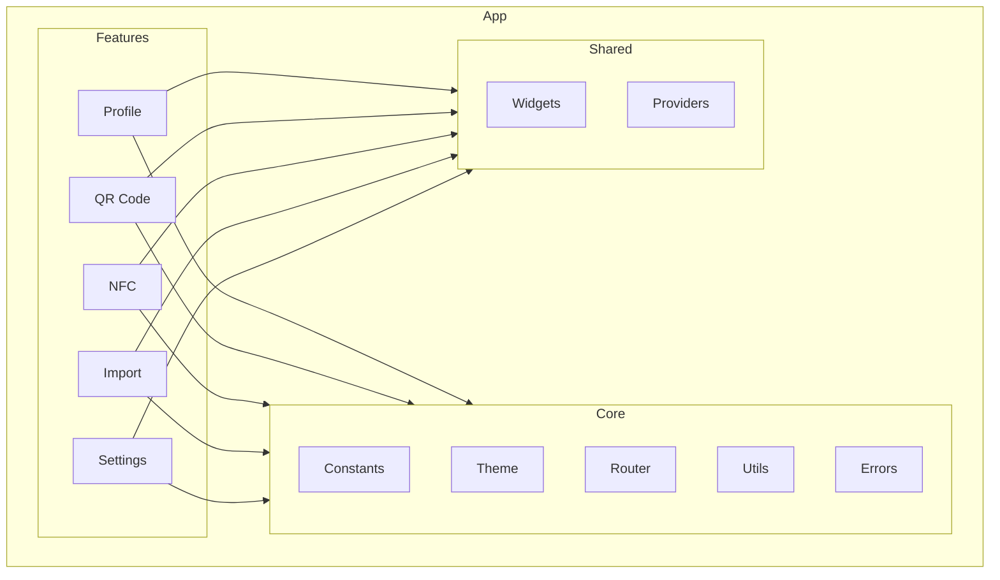
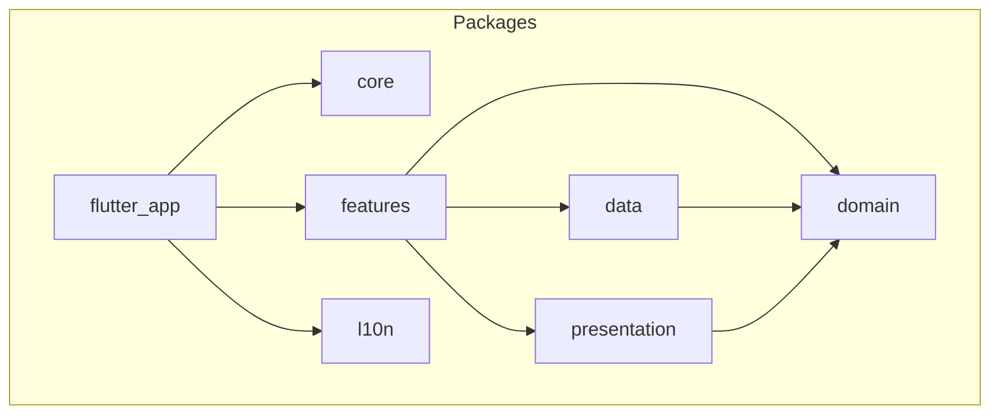

# UML — VCardSmart

## Class Diagram

### Profile

### Repository

### UseCase

## Sequence Diagram

### Profile Creation

### QR Code Share

## Activity Diagram

### Profile Flow

### Import Flow

## State Diagram

### Profile State

## Component Diagram

### App Structure

## Package Diagram

