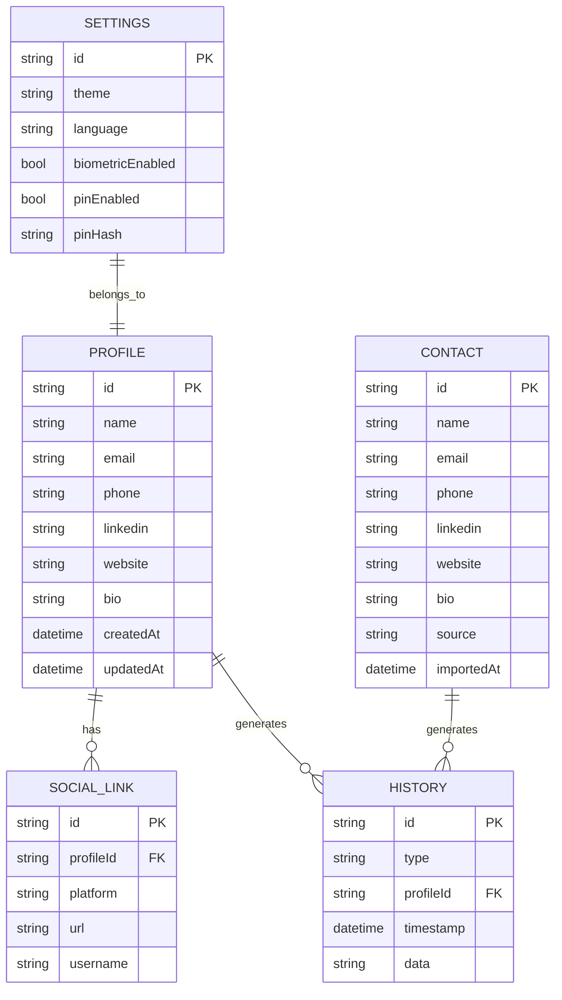

# ER Diagram — VCardSmart

## Modelo de Dados

### Profile

## Tabelas

### profile

| Campo | Tipo | PK | FK | Descrição |
|-------|------|----|----|-----------|
| id | String | ✅ | - | Identificador único |
| name | String | - | - | Nome (obrigatório) |
| email | String? | - | - | Email |
| phone | String? | - | - | Telefone |
| linkedin | String? | - | - | LinkedIn |
| website | String? | - | - | Website |
| bio | String? | - | - | Biografia |
| createdAt | DateTime | - | - | Data de criação |
| updatedAt | DateTime | - | - | Data de atualização |

### social_link

| Campo | Tipo | PK | FK | Descrição |
|-------|------|----|----|-----------|
| id | String | ✅ | - | Identificador único |
| profileId | String | - | ✅ | ID do perfil |
| platform | String | - | - | Plataforma |
| url | String | - | - | URL |
| username | String? | - | - | Nome de usuário |

### contact

| Campo | Tipo | PK | FK | Descrição |
|-------|------|----|----|-----------|
| id | String | ✅ | - | Identificador único |
| name | String | - | - | Nome |
| email | String? | - | - | Email |
| phone | String? | - | - | Telefone |
| linkedin | String? | - | - | LinkedIn |
| website | String? | - | - | Website |
| bio | String? | - | - | Biografia |
| source | String | - | - | Fonte (QR/NFC/vCard) |
| importedAt | DateTime | - | - | Data de importação |

### settings

| Campo | Tipo | PK | FK | Descrição |
|-------|------|----|----|-----------|
| id | String | ✅ | - | Identificador único |
| theme | String | - | - | Tema (light/dark/system) |
| language | String | - | - | Idioma |
| biometricEnabled | bool | - | - | Biometria habilitada |
| pinEnabled | bool | - | - | PIN habilitado |
| pinHash | String? | - | - | Hash do PIN |

### history

| Campo | Tipo | PK | FK | Descrição |
|-------|------|----|----|-----------|
| id | String | ✅ | - | Identificador único |
| type | String | - | - | Tipo (share/import) |
| profileId | String | - | ✅ | ID do perfil |
| timestamp | DateTime | - | - | Data/hora |
| data | String | - | - | Dados extras |

## Relacionamentos

### Profile → SocialLink

- **Um para muitos**: Um perfil pode ter vários links sociais
- **Cascata**: Ao excluir perfil, excluir links

### Profile → History

- **Um para muitos**: Um perfil pode ter vários registros de histórico
- **Cascata**: Ao excluir perfil, excluir histórico

### Profile → Settings

- **Um para um**: Cada perfil tem configurações
- **Cascata**: Ao excluir perfil, excluir configurações

## Índices

### profile

- `id` (único)
- `name`
- `email`

### social_link

- `id` (único)
- `profileId`
- `platform`

### contact

- `id` (único)
- `name`
- `email`
- `source`

### settings

- `id` (único)

### history

- `id` (único)
- `profileId`
- `type`
- `timestamp`

## Validações

### profile

- `name`: obrigatório, mínimo 1 caractere
- `email`: formato válido (se preenchido)
- `phone`: formato válido (se preenchido)

### social_link

- `platform`: obrigatório
- `url`: formato válido

### contact

- `name`: obrigatório
- `source`: deve ser QR, NFC ou vCard

### settings

- `theme`: deve ser light, dark ou system
- `language`: deve ser código de idioma válido
