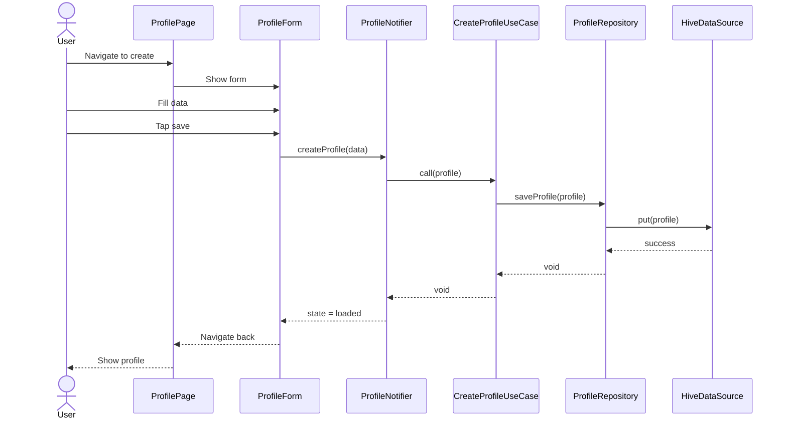
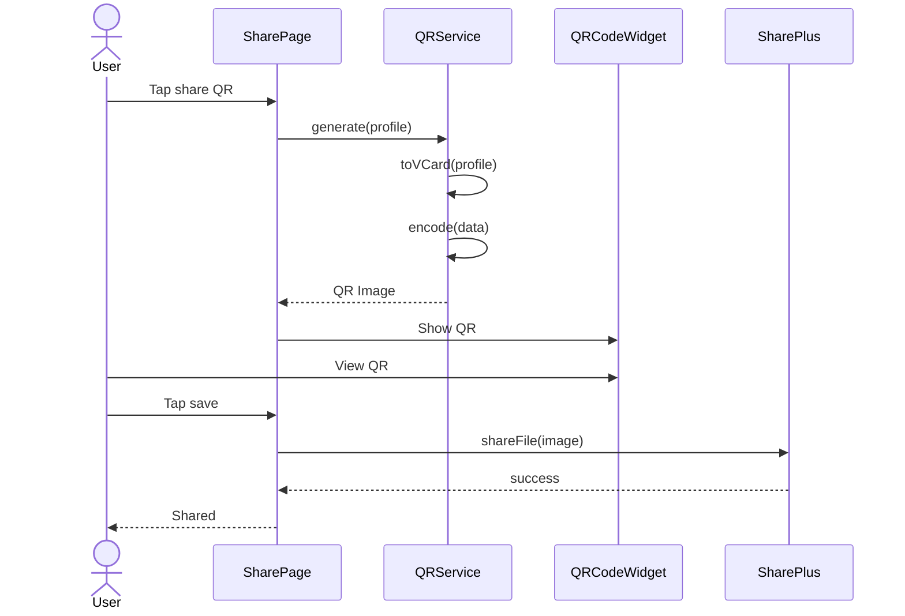
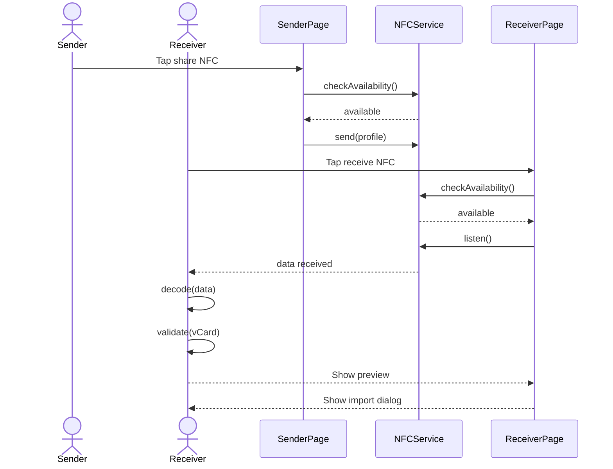
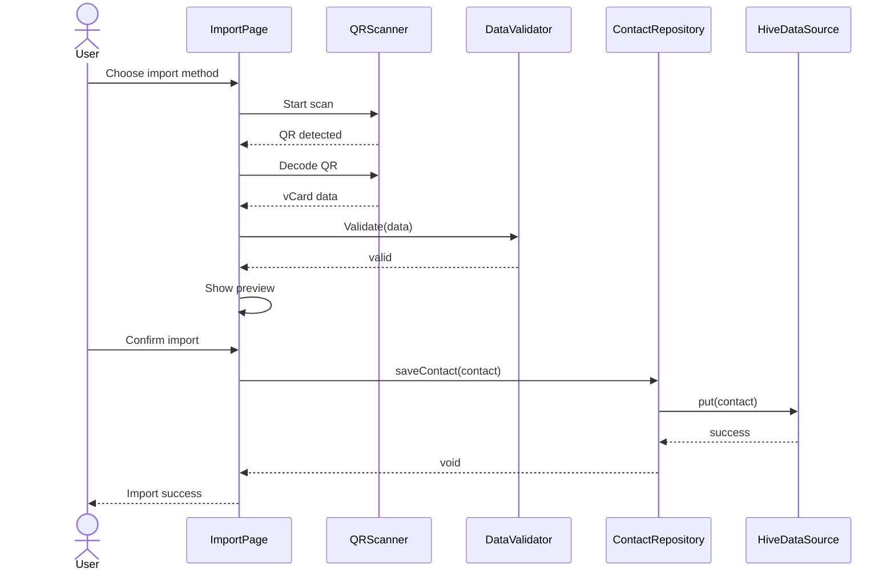
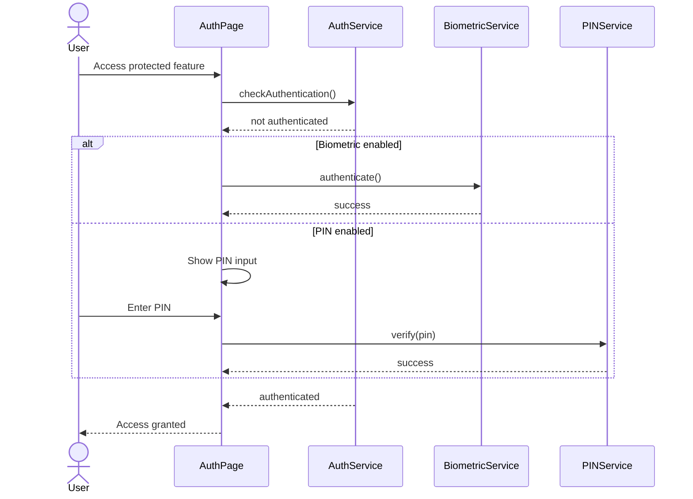
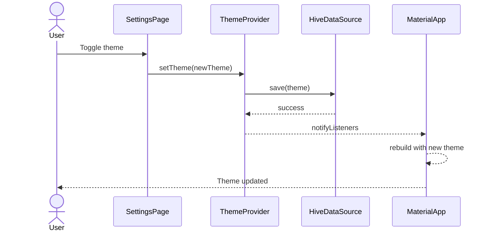
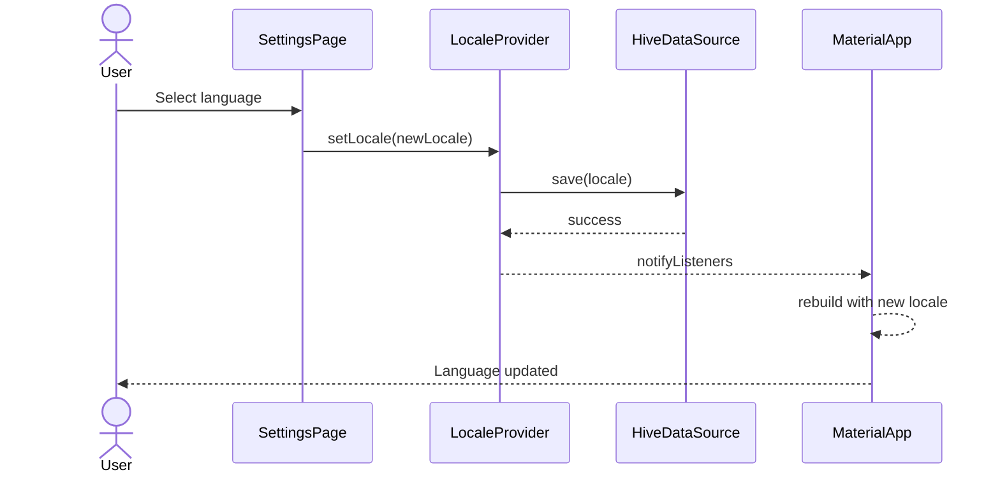

# Sequence Diagrams — VCardSmart

## Profile Creation

```mermaid
sequenceDiagram
    actor User
    participant Page as ProfilePage
    participant Form as ProfileForm
    participant Notifier as ProfileNotifier
    participant UseCase as CreateProfileUseCase
    participant Repo as ProfileRepository
    participant DS as HiveDataSource
    
    User->>Page: Navigate to create
    Page->>Form: Show form
    User->>Form: Fill data
    User->>Form: Tap save
    Form->>Notifier: createProfile(data)
    Notifier->>UseCase: call(profile)
    UseCase->>Repo: saveProfile(profile)
    Repo->>DS: put(profile)
    DS-->>Repo: success
    Repo-->>UseCase: void
    UseCase-->>Notifier: void
    Notifier-->>Form: state = loaded
    Form-->>Page: Navigate back
    Page-->>User: Show profile
```

## QR Code Share

```mermaid
sequenceDiagram
    actor User
    participant Page as SharePage
    participant QR as QRService
    participant Widget as QRCodeWidget
    participant Share as SharePlus
    
    User->>Page: Tap share QR
    Page->>QR: generate(profile)
    QR->>QR: toVCard(profile)
    QR->>QR: encode(data)
    QR-->>Page: QR Image
    Page->>Widget: Show QR
    User->>Widget: View QR
    User->>Page: Tap save
    Page->>Share: shareFile(image)
    Share-->>Page: success
    Page-->>User: Shared
```

## NFC Share

```mermaid
sequenceDiagram
    actor Sender
    actor Receiver
    participant SPage as SenderPage
    participant NFC as NFCService
    participant RPage as ReceiverPage
    
    Sender->>SPage: Tap share NFC
    SPage->>NFC: checkAvailability()
    NFC-->>SPage: available
    SPage->>NFC: send(profile)
    
    Receiver->>RPage: Tap receive NFC
    RPage->>NFC: checkAvailability()
    NFC-->>RPage: available
    RPage->>NFC: listen()
    
    NFC-->>Receiver: data received
    Receiver->>Receiver: decode(data)
    Receiver->>Receiver: validate(vCard)
    Receiver-->>RPage: Show preview
    RPage-->>Receiver: Show import dialog
```

## Import Contact

```mermaid
sequenceDiagram
    actor User
    participant Page as ImportPage
    participant Scanner as QRScanner
    participant Validator as DataValidator
    participant Repo as ContactRepository
    participant DS as HiveDataSource
    
    User->>Page: Choose import method
    Page->>Scanner: Start scan
    Scanner-->>Page: QR detected
    Page->>Scanner: Decode QR
    Scanner-->>Page: vCard data
    Page->>Validator: Validate(data)
    Validator-->>Page: valid
    Page->>Page: Show preview
    User->>Page: Confirm import
    Page->>Repo: saveContact(contact)
    Repo->>DS: put(contact)
    DS-->>Repo: success
    Repo-->>Page: void
    Page-->>User: Import success
```

## Authentication

```mermaid
sequenceDiagram
    actor User
    participant Page as AuthPage
    participant Auth as AuthService
    participant Bio as BiometricService
    participant PIN as PINService
    
    User->>Page: Access protected feature
    Page->>Auth: checkAuthentication()
    Auth-->>Page: not authenticated
    
    alt Biometric enabled
        Page->>Bio: authenticate()
        Bio-->>Page: success
    else PIN enabled
        Page->>Page: Show PIN input
        User->>Page: Enter PIN
        Page->>PIN: verify(pin)
        PIN-->>Page: success
    end
    
    Auth-->>Page: authenticated
    Page-->>User: Access granted
```

## Theme Switch

```mermaid
sequenceDiagram
    actor User
    participant Page as SettingsPage
    participant Provider as ThemeProvider
    participant DS as HiveDataSource
    participant App as MaterialApp
    
    User->>Page: Toggle theme
    Page->>Provider: setTheme(newTheme)
    Provider->>DS: save(theme)
    DS-->>Provider: success
    Provider-->>App: notifyListeners
    App-->>App: rebuild with new theme
    App-->>User: Theme updated
```

## Language Switch

```mermaid
sequenceDiagram
    actor User
    participant Page as SettingsPage
    participant Provider as LocaleProvider
    participant DS as HiveDataSource
    participant App as MaterialApp
    
    User->>Page: Select language
    Page->>Provider: setLocale(newLocale)
    Provider->>DS: save(locale)
    DS-->>Provider: success
    Provider-->>App: notifyListeners
    App-->>App: rebuild with new locale
    App-->>User: Language updated
```
