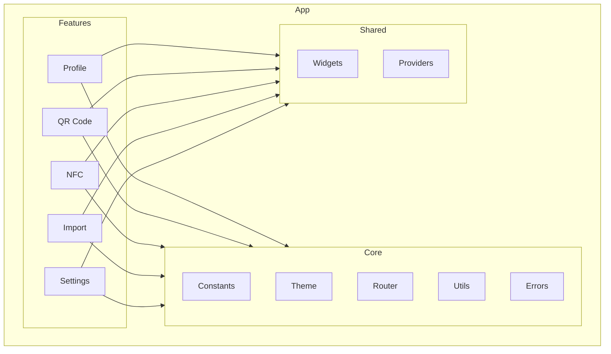
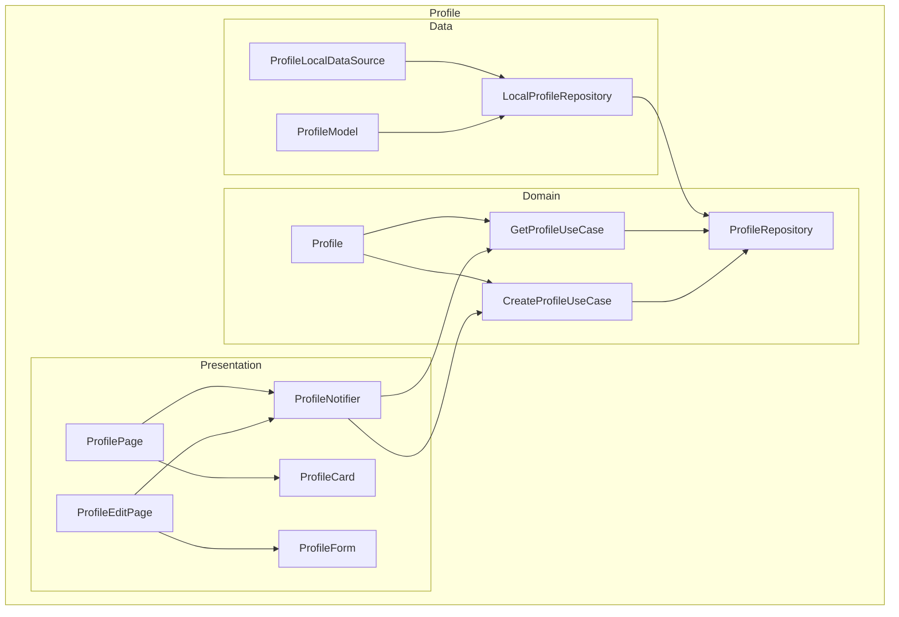
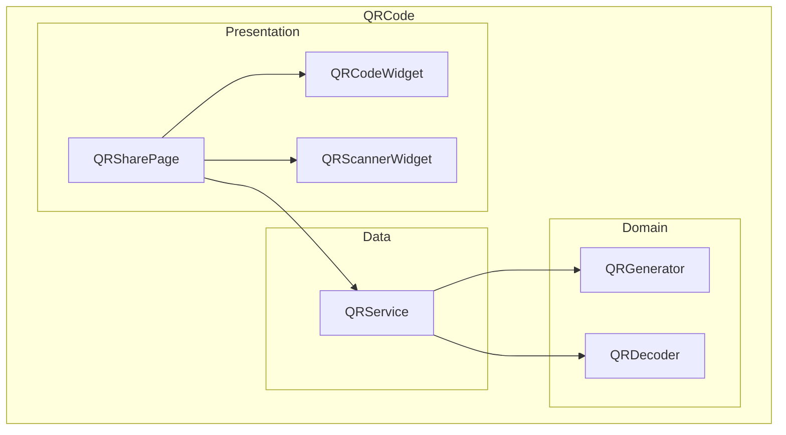
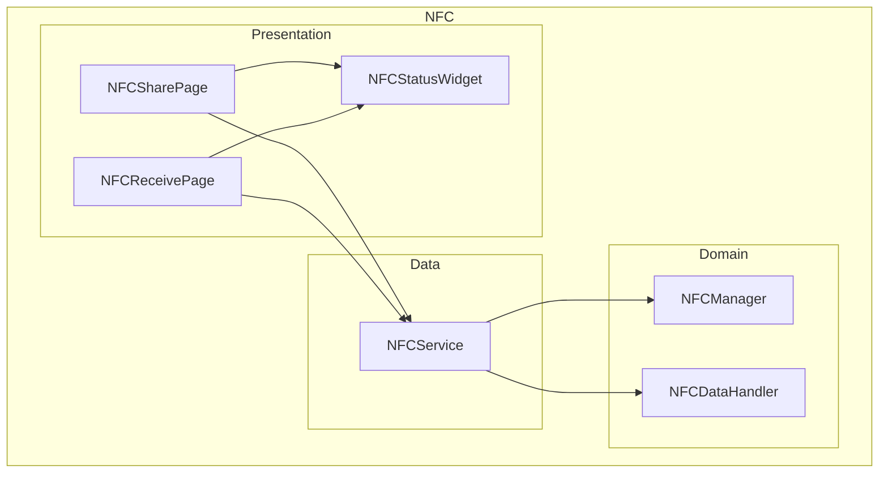
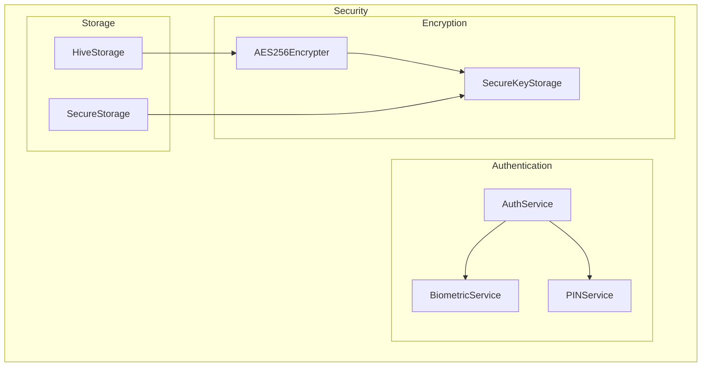
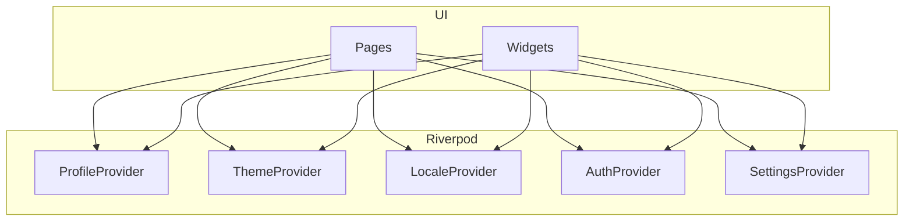
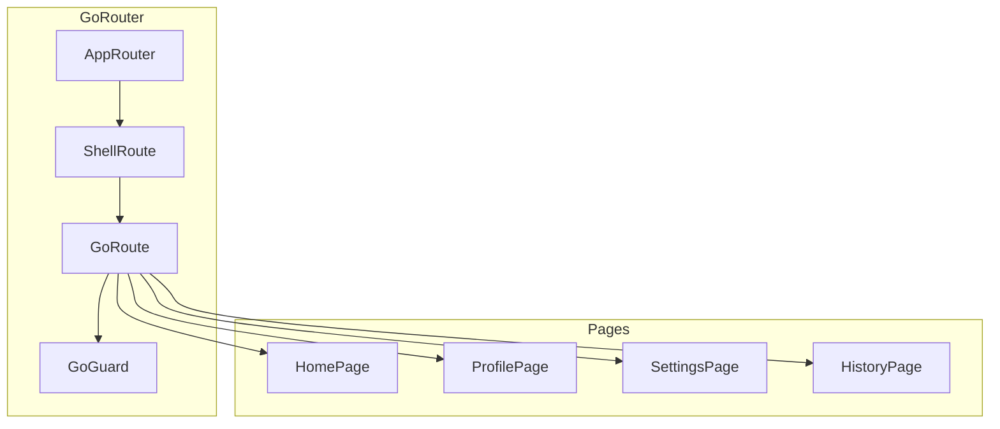

# Component Diagrams — VCardSmart

## App Components

```mermaid
graph TB
    subgraph App
        subgraph Core
            A[Constants]
            B[Theme]
            C[Router]
            D[Utils]
            E[Errors]
        end
        
        subgraph Features
            F[Profile]
            G[QR Code]
            H[NFC]
            I[Import]
            J[Settings]
        end
        
        subgraph Shared
            K[Widgets]
            L[Providers]
        end
    end
    
    F --> Core
    G --> Core
    H --> Core
    I --> Core
    J --> Core
    F --> Shared
    G --> Shared
    H --> Shared
    I --> Shared
    J --> Shared
```

## Profile Feature

```mermaid
graph TB
    subgraph Profile
        subgraph Data
            D1[ProfileLocalDataSource]
            D2[ProfileModel]
            D3[LocalProfileRepository]
        end
        
        subgraph Domain
            DO1[Profile]
            DO2[GetProfileUseCase]
            DO3[CreateProfileUseCase]
            DO4[ProfileRepository]
        end
        
        subgraph Presentation
            P1[ProfilePage]
            P2[ProfileEditPage]
            P3[ProfileCard]
            P4[ProfileForm]
            P5[ProfileNotifier]
        end
    end
    
    D1 --> D3
    D2 --> D3
    D3 --> DO4
    DO1 --> DO2
    DO1 --> DO3
    DO2 --> DO4
    DO3 --> DO4
    P5 --> DO2
    P5 --> DO3
    P1 --> P5
    P2 --> P5
    P1 --> P3
    P2 --> P4
```

## QR Code Feature

```mermaid
graph TB
    subgraph QRCode
        subgraph Data
            D1[QRService]
        end
        
        subgraph Domain
            DO1[QRGenerator]
            DO2[QRDecoder]
        end
        
        subgraph Presentation
            P1[QRSharePage]
            P2[QRCodeWidget]
            P3[QRScannerWidget]
        end
    end
    
    D1 --> DO1
    D1 --> DO2
    P1 --> D1
    P1 --> P2
    P1 --> P3
```

## NFC Feature

```mermaid
graph TB
    subgraph NFC
        subgraph Data
            D1[NFCService]
        end
        
        subgraph Domain
            DO1[NFCManager]
            DO2[NFCDataHandler]
        end
        
        subgraph Presentation
            P1[NFCSharePage]
            P2[NFCReceivePage]
            P3[NFCStatusWidget]
        end
    end
    
    D1 --> DO1
    D1 --> DO2
    P1 --> D1
    P2 --> D1
    P1 --> P3
    P2 --> P3
```

## Security Components

```mermaid
graph TB
    subgraph Security
        subgraph Encryption
            E1[AES256Encrypter]
            E2[SecureKeyStorage]
        end
        
        subgraph Authentication
            A1[BiometricService]
            A2[PINService]
            A3[AuthService]
        end
        
        subgraph Storage
            S1[HiveStorage]
            S2[SecureStorage]
        end
    end
    
    E1 --> E2
    A3 --> A1
    A3 --> A2
    S1 --> E1
    S2 --> E2
```

## State Management

```mermaid
graph TB
    subgraph Riverpod
        P1[ProfileProvider]
        P2[ThemeProvider]
        P3[LocaleProvider]
        P4[AuthProvider]
        P5[SettingsProvider]
    end
    
    subgraph UI
        U1[Pages]
        U2[Widgets]
    end
    
    U1 --> P1
    U1 --> P2
    U1 --> P3
    U1 --> P4
    U1 --> P5
    U2 --> P1
    U2 --> P2
    U2 --> P3
    U2 --> P4
    U2 --> P5
```

## Navigation Components

```mermaid
graph TB
    subgraph GoRouter
        R1[AppRouter]
        R2[ShellRoute]
        R3[GoRoute]
        R4[GoGuard]
    end
    
    subgraph Pages
        P1[HomePage]
        P2[ProfilePage]
        P3[SettingsPage]
        P4[HistoryPage]
    end
    
    R1 --> R2
    R2 --> R3
    R3 --> R4
    R3 --> P1
    R3 --> P2
    R3 --> P3
    R3 --> P4
```
