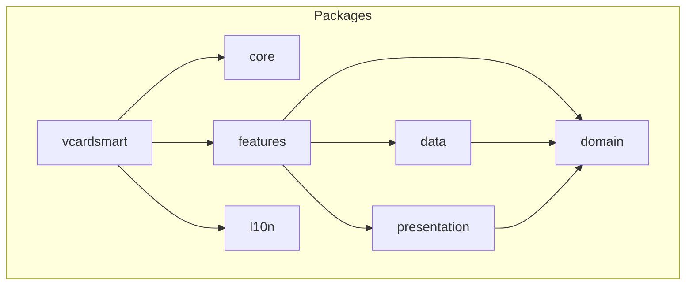
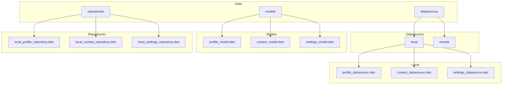
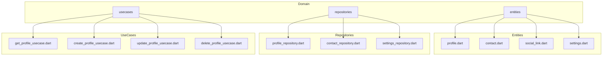
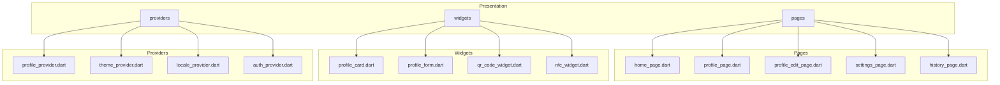
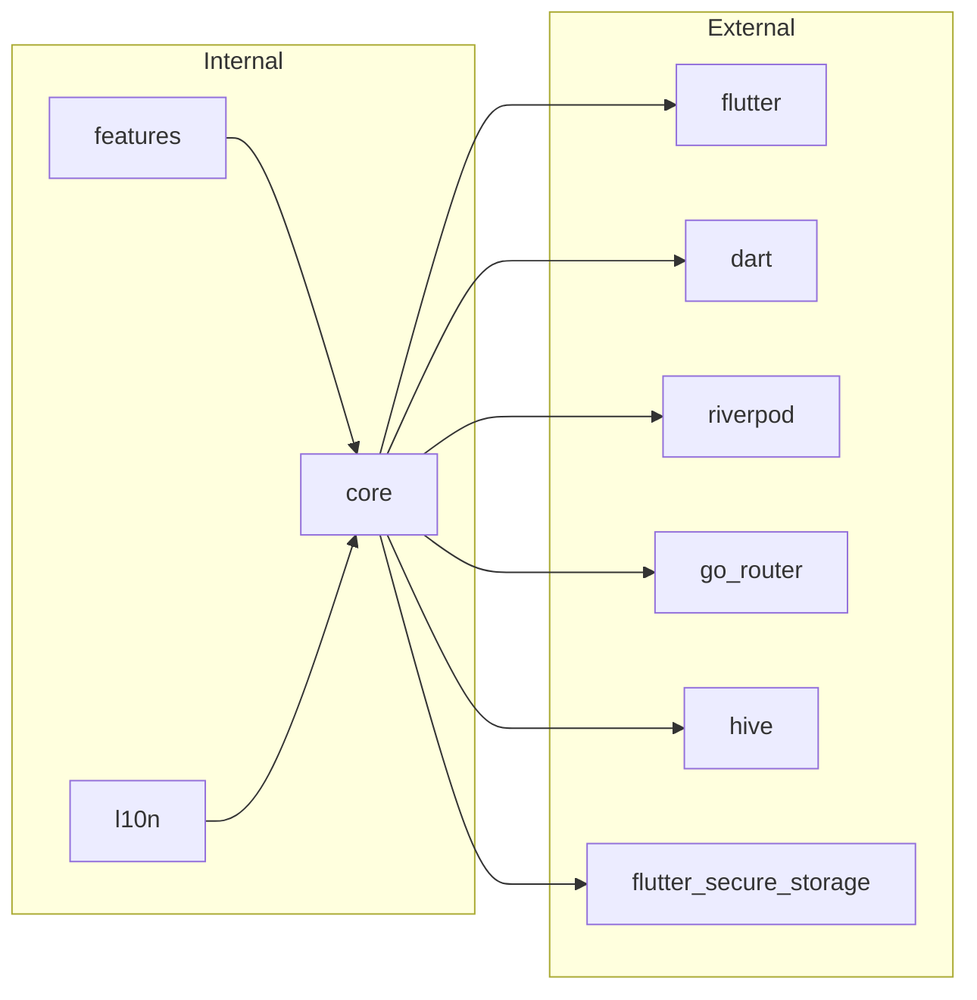

# Package Diagrams — VCardSmart

## Package Structure

```mermaid
graph TB
    subgraph Packages
        A[vcardsmart]
        B[core]
        C[features]
        D[data]
        E[domain]
        F[presentation]
        G[l10n]
    end
    
    A --> B
    A --> C
    A --> G
    C --> D
    C --> E
    C --> F
    D --> E
    F --> E
```

## Core Package

```mermaid
graph TB
    subgraph Core
        A[constants]
        B[theme]
        C[router]
        D[utils]
        E[errors]
        F[di]
    end
    
    subgraph Constants
        A1[app_constants.dart]
        A2[hive_boxes.dart]
        A3[api_constants.dart]
    end
    
    subgraph Theme
        B1[app_theme.dart]
        B2[app_colors.dart]
        B3[app_text_styles.dart]
    end
    
    subgraph Router
        C1[app_router.dart]
        C2[route_names.dart]
    end
    
    subgraph Utils
        D1[encryption_utils.dart]
        D2[vcard_utils.dart]
        D3[date_utils.dart]
    end
    
    subgraph Errors
        E1[app_exception.dart]
        E2[error_handler.dart]
    end
    
    subgraph DI
        F1[service_locator.dart]
    end
    
    A --> A1
    A --> A2
    A --> A3
    B --> B1
    B --> B2
    B --> B3
    C --> C1
    C --> C2
    D --> D1
    D --> D2
    D --> D3
    E --> E1
    E --> E2
    F --> F1
```

## Features Package

```mermaid
graph TB
    subgraph Features
        A[profile]
        B[qr_code]
        C[nfc]
        D[import]
        E[settings]
        F[history]
    end
    
    subgraph Profile
        A1[data]
        A2[domain]
        A3[presentation]
    end
    
    subgraph QR Code
        B1[data]
        B2[domain]
        B3[presentation]
    end
    
    subgraph NFC
        C1[data]
        C2[domain]
        C3[presentation]
    end
    
    subgraph Import
        D1[data]
        D2[domain]
        D3[presentation]
    end
    
    subgraph Settings
        E1[data]
        E2[domain]
        E3[presentation]
    end
    
    subgraph History
        F1[data]
        F2[domain]
        F3[presentation]
    end
    
    A --> A1
    A --> A2
    A --> A3
    B --> B1
    B --> B2
    B --> B3
    C --> C1
    C --> C2
    C --> C3
    D --> D1
    D --> D2
    D --> D3
    E --> E1
    E --> E2
    E --> E3
    F --> F1
    F --> F2
    F --> F3
```

## Data Package

```mermaid
graph TB
    subgraph Data
        A[datasources]
        B[models]
        C[repositories]
    end
    
    subgraph Datasources
        A1[local]
        A2[remote]
    end
    
    subgraph Local
        A11[profile_datasource.dart]
        A12[contact_datasource.dart]
        A13[settings_datasource.dart]
    end
    
    subgraph Models
        B1[profile_model.dart]
        B2[contact_model.dart]
        B3[settings_model.dart]
    end
    
    subgraph Repositories
        C1[local_profile_repository.dart]
        C2[local_contact_repository.dart]
        C3[local_settings_repository.dart]
    end
    
    A --> A1
    A --> A2
    A1 --> A11
    A1 --> A12
    A1 --> A13
    B --> B1
    B --> B2
    B --> B3
    C --> C1
    C --> C2
    C --> C3
```

## Domain Package

```mermaid
graph TB
    subgraph Domain
        A[entities]
        B[repositories]
        C[usecases]
    end
    
    subgraph Entities
        A1[profile.dart]
        A2[contact.dart]
        A3[social_link.dart]
        A4[settings.dart]
    end
    
    subgraph Repositories
        B1[profile_repository.dart]
        B2[contact_repository.dart]
        B3[settings_repository.dart]
    end
    
    subgraph UseCases
        C1[get_profile_usecase.dart]
        C2[create_profile_usecase.dart]
        C3[update_profile_usecase.dart]
        C4[delete_profile_usecase.dart]
    end
    
    A --> A1
    A --> A2
    A --> A3
    A --> A4
    B --> B1
    B --> B2
    B --> B3
    C --> C1
    C --> C2
    C --> C3
    C --> C4
```

## Presentation Package

```mermaid
graph TB
    subgraph Presentation
        A[pages]
        B[widgets]
        C[providers]
    end
    
    subgraph Pages
        A1[home_page.dart]
        A2[profile_page.dart]
        A3[profile_edit_page.dart]
        A4[settings_page.dart]
        A5[history_page.dart]
    end
    
    subgraph Widgets
        B1[profile_card.dart]
        B2[profile_form.dart]
        B3[qr_code_widget.dart]
        B4[nfc_widget.dart]
    end
    
    subgraph Providers
        C1[profile_provider.dart]
        C2[theme_provider.dart]
        C3[locale_provider.dart]
        C4[auth_provider.dart]
    end
    
    A --> A1
    A --> A2
    A --> A3
    A --> A4
    A --> A5
    B --> B1
    B --> B2
    B --> B3
    B --> B4
    C --> C1
    C --> C2
    C --> C3
    C --> C4
```

## Dependency Graph

```mermaid
graph LR
    subgraph External
        A[flutter]
        B[dart]
        C[riverpod]
        D[go_router]
        E[hive]
        F[flutter_secure_storage]
    end
    
    subgraph Internal
        G[core]
        H[features]
        I[l10n]
    end
    
    G --> A
    G --> B
    G --> C
    G --> D
    G --> E
    G --> F
    H --> G
    I --> G
```
